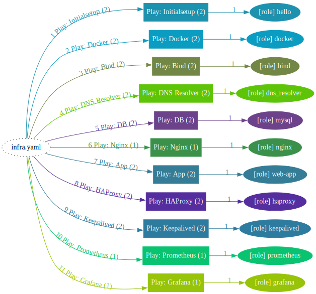

This project was made as a way to learn how to implement CI/CD pipelines and build infrastructure for that.

This repository contains web application written in Go and JS, ansible IaaC, github Actions Workflows and some scripts to ease the local testing

How to run:

  1. Download docker-compose and .env files and start it (recommended way).
  
Do not forget to set environmental variables
         
             docker-compose up
  2.  The app can also be pulled from dockerhub, but MySQL needs to be running and env variables needs to be set

❗Don't forget to create and set env variables for both MySQL and web-app ❗

            docker pull floppaxx/web-app-automation:latest
            docker pull mysql:latest
            docker run --env-file .env.app --network host floppax/web-app-automation
            docker run --env-file .env.db --network host mysql

To-do list:
  1. I am unable to configure Entra ID to provision VMs with ansible on my current Azure subscription.
  2. Implement backup and logging solutions.
  3. Write actual tests
  4. Add users
Ansible playbook is triggered manually, because with my current Azure subscription I cannot configure Entra ID and provision VMs automatically. Therefore I need to provide VMs IPs to start playbook. VMs need to have atleast one core and 2 Gb of RAM.

Ansible structure:
